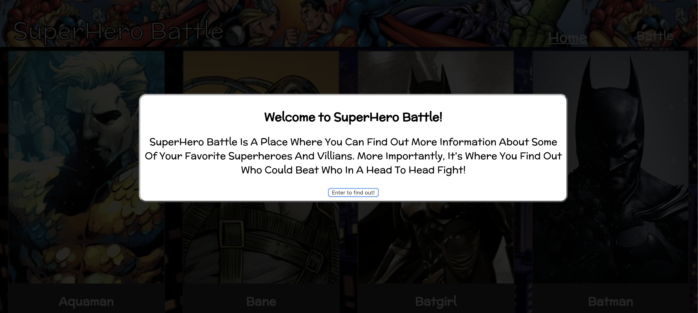
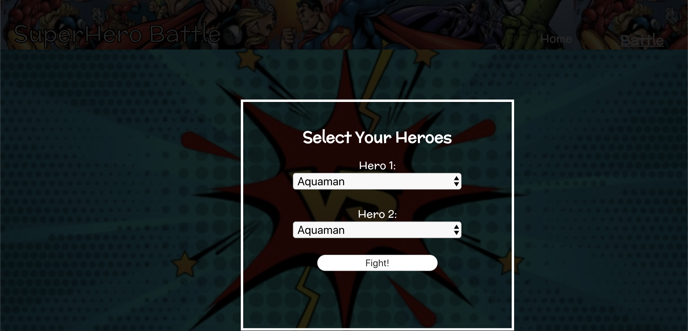
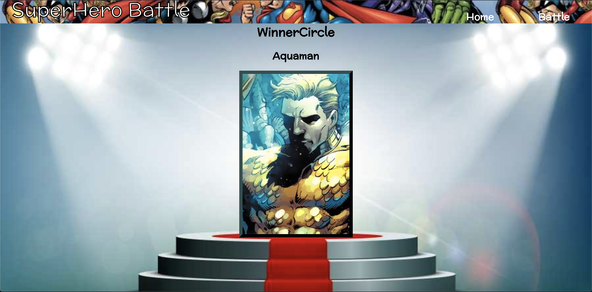

# SuperHero Battle
By:
[Chris Basham](https://github.com/chrisdbasham317)

## Table of Contents
* [Built With](#Built-With) 
* [Screenshots](#Screenshots)
* [Features](#Features)
* [Try It Out](#Try-It-Out)
* [Take It For A Spin](#Take-It-For-A-Spin)
* [Why'd-We-Do-This?](Why'd-We-Do-This?)
* [Link to Project Management Board](Link-to-Project-Management-Board)

## Built With

- HTML5
- CSS3
- JavaScript
- React
- Router
- Redux
- Thunks
- TDD (Jest, Enzyme)
- OOP
- Fetch API - akabab.github.io/superhero-api

## Screenshots

Here is screen shot walkthrough of the app:

## Features

- [x] Built on React
- [x] React Modals
- [x] React Router
- [x] Thunk MiddleWare
- [x] Fetch
- [x] Loading Screen while battle is in progress
- [x] Paths making use of forward/back button
- [X] Dynamic path setting 

## Try It Out

- [x] Learn about your favorite heroes!
- [X] Click "more info" to learn more about a hero.
- [X] Like that hero? Click "choose hero" to select that hero for battle!
- [x] The second hero can be chosen via the dropdown, or by pressing "back" and going home to view the rest of the heroes.
- [X] Once you are happy with your contestants, click "Fight!"
- [X] Wait for the battle to conclude, and press "View Results"
- [X] The winner will be displayed atop the podium in the winner's circle. 
- [x] Did your hero win? Pit them against someone else!

## Take It For A Spin

This site requres a few steps to get full functionality.
To view the site and get more info about superheros follow this site:

Coming soon!

## Why'd I Do This?

This was a solo project for Turing School of Software and Design. It was a project used to display my understanding of the tech stack, workflow processes, and a chance to design/build an app born in my own mind. I love superheroes, and essentially anything "nerdy". SuperHero Battle allows me to express exactly that!

